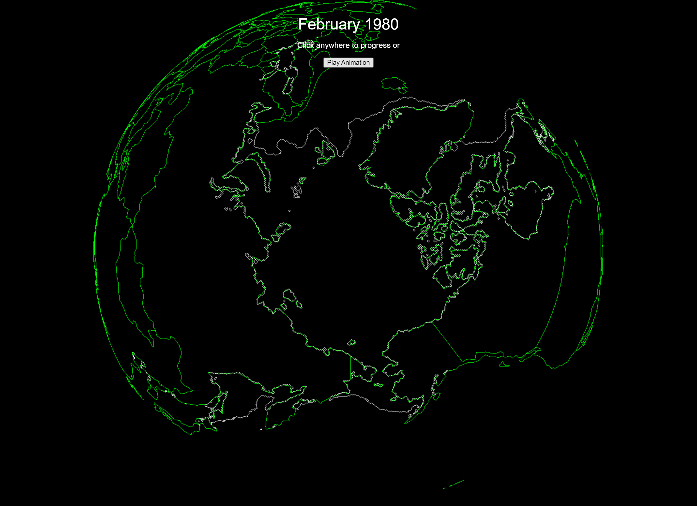

# Demo:
http://arctic-ice.liamosler.ca/

https://www.youtube.com/embed/-B-H4IHNeJc



# Basic Setup:

Requirements:
- NodeJS
- Express
- ThreeJS

### Setting up basic express server:
```javascript
//Node packages:
const express = require('express')
const app = express()
const port = 3000
const path = require('path');
const fs = require('fs');

//Specify the paths for the public html folder and threeJS:
app.use('/public', express.static('public'))
app.use('/three/build', express.static('node_modules/three/build'))

//Routing:
//"Homepage" displays index.html:
app.get('/', (req, res) => {
  res.sendFile(path.join(__dirname, '/public/index.html'));
})

app.listen(port, () => {
  console.log(`Example app listening on port ${port}`)
})
```

index.html:
```html
<!DOCTYPE html>
<html>
	<head>
		<meta charset="utf-8">
		<title>My first three.js app</title>
		<style>
			body { margin: 0; }
		</style>
	</head>
	<body>
		<script type = "module" src ="./public/index.js"></script>
	</body>
</html>
```

index.js:
```javascript
//Import ThreeJS:
import * as THREE from "../three/build/three.module.js";
```

## Adding a primitive sphere to the scene:
To check that every thing is working so far, let's add a sphere to the screen, it will also serve as a 
```javascript
import * as THREE from "../three/build/three.module.js";

//3JS scene:
const scene = new THREE.Scene();
const camera = new THREE.PerspectiveCamera( 10, window.innerWidth / window.innerHeight, 0.1, 1000 );

const renderer = new THREE.WebGLRenderer();
renderer.setSize( window.innerWidth, window.innerHeight );
document.body.appendChild( renderer.domElement );

var geometry = new THREE.BoxGeometry( 1, 1, 1 );
var wireframeMaterial = new THREE.MeshBasicMaterial({ wireframe: true, color: 0xffffff })

var blackMaterial = new THREE.MeshPhongMaterial( {
    color: 0xff0000,
    polygonOffset: true,
    polygonOffsetFactor: 1, // positive value pushes polygon further away
    polygonOffsetUnits: 1
} );

var sphereGeometry = new THREE.SphereGeometry( 1, 24, 24 );
var meshSphere = new THREE.Mesh( sphereGeometry, blackMaterial );
var wireframe = new THREE.LineSegments( sphereGeometry, wireframeMaterial );

scene.add( meshSphere );
meshSphere.add( wireframe );

var mesh = new THREE.Mesh( geometry, blackMaterial );
scene.add( mesh )
// wireframe
var geo = new THREE.EdgesGeometry( mesh.geometry ); // or WireframeGeometry
var mat = new THREE.LineBasicMaterial( { color: 0xffffff } );
var wireframe = new THREE.LineSegments( geo, mat );
mesh.add( wireframe );

//Set the camera position and direction:
camera.up = new THREE.Vector3(0,1,0);
camera.position.y = 10;
camera.position.x = 10;

function animate() {
    requestAnimationFrame( animate );
    camera.lookAt(0, 0, 0);
    meshSphere.rotation.y +=0.001;
    mesh.rotation.x +=0.01;
    renderer.render( scene, camera );
};

animate();
```

### Camera controls:
```javascript
let mouseTrack = {"x":0, "y":0};
function onMouseMove(e){
    mouseTrack.x = e.clientX - window.innerWidth/2;  
    mouseTrack.y = e.clientY - window.innerHeight/2;

    if(Math.abs(mouseTrack.x) < 200){
        mouseTrack.x = 0;
    }
    if(Math.abs(mouseTrack.y) < 200){
        mouseTrack.y = 0;
    }
}

//console.log(countryPoints);
const camera = new THREE.PerspectiveCamera( 45, window.innerWidth / window.innerHeight, 1, 10000 );
//Set the camera position and direction:
camera.up = new THREE.Vector3(0,1,0);
//controls.update() must be called after any manual changes to the camera's transform
let orbitAngle = {"x":0, "y":80, "radius": 300};
function onScroll(event){
    if(event.wheelDeltaY < 0){
        if(orbitAngle.radius > 200){
            orbitAngle.radius-=10;
        }
    }
    if(event.wheelDeltaY > 0){
        if(orbitAngle.radius < 400){
            orbitAngle.radius+=10;
        }
    }
}
function cameraPosition(){
    orbitAngle.x -= mouseTrack.x/1000;
    orbitAngle.y -= mouseTrack.y/1000;
    orbitAngle.y = Math.max(-85, Math.min(85, orbitAngle.y));

    let lat = Math.max(-85, Math.min(85, orbitAngle.y));
    let phi = THREE.Math.degToRad(90 - lat);
    let theta = THREE.Math.degToRad(orbitAngle.x);
    
    camera.position.x = orbitAngle.radius * Math.sin( phi ) * Math.cos( theta );
    camera.position.y = orbitAngle.radius * Math.cos( phi );
    camera.position.z = orbitAngle.radius * Math.sin( phi ) * Math.sin( theta );
}
```

And we will add a call to cameraPosition in our animation loop, and specify camera.lookAt:

```js
function animate() {
    requestAnimationFrame(animate);
    cameraPosition();


}


```

